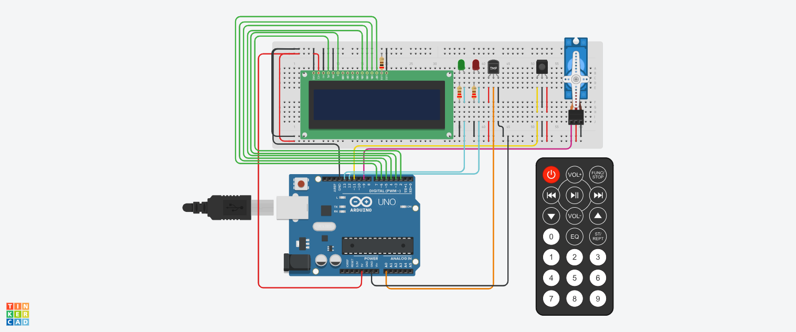

## Sistema de incendios

---
## Descripcion:
El código proporcionado es un programa en C++ que simula el funcionamiento de un sistema de incendios don un sensor de temperatura y 2LEDs. Se utiliza un Display LCD (16x2 caracteres) para mostrar  la temperatura actual y la estación del año. Cuando se detecta un incendio, muestra un mensaje de alarma en el display LCD, con un umbral de temperatura maxima,. El programa se ejecuta en una placa Arduino y se activa un servo motor para simular una respuesta del sistema de incendio.. y con un Control remoto IR (Infrarrojo) con el boton 1 se enceiende y con el 2 se apaga. En resumen, es una simulación de un sistema de incendios, mostrar temperatura y estacion del año y al superar un umbral de temperatura se enciende la alarma para alertar un incendio.
---
## Configuración de pines
---
~~~c++
// Configuración del control remoto IR
int IR = 11;

// Configuración del display LCD
LiquidCrystal lcd(2, 3, 4, 5, 6, 7);

// Configuración del sensor de temperatura
int sensorPin = A0;

// Configuración del servo motor
int servoPin = 9;
Servo servo;

// Configuración de los leds
int LED = 13;
int LED2 = 12;

~~~
## Variables
~~~c++
// Umbral de temperatura para detectar incendio
int temperaturaUmbral = 60;

// Rangos de temperatura para cada estación
int temperaturaInviernoMin = -20;
int temperaturaInviernoMax = 10;
int temperaturaPrimaveraMin = 25;
int temperaturaPrimaveraMax = 35;
int temperaturaVeranoMin = 35;
int temperaturaVeranoMax = 50;
int temperaturaOtonioMin = 10;
int temperaturaOtonioMax = 25;
~~~
Se define el pin en el que está conectado el receptor IR (int IR = 11;) para recibir las señales del control remoto.
Se crea una instancia de LiquidCrystal llamada lcd para controlar el display LCD. Se especifican los pines de conexión del display.
Se define el pin en el que está conectado el sensor de temperatura (sensorPin).
Se define el pin en el que está conectado el servo motor (servoPin) y se crea una instancia de Servo llamada servo para controlarlo.
Se definen los pines en los que están conectados los leds de alarma (ledPin1 y ledPin2).
Se establece el umbral de temperatura (temperaturaUmbral) a partir del cual se considera que hay un incendio.
Se definen los rangos de temperatura para cada estación del año.

## Función de configuración (setup)
~~~c++
void setup() {
  // Inicialización del control remoto IR
  irrecv.enableIRIn();

  // Inicialización del display LCD
  lcd.begin(16, 2);
  lcd.setCursor(0, 0);
  lcd.print("Temp:");
  lcd.setCursor(0, 1);
  lcd.print("Estacion:");

  // Inicialización del servo motor
  servo.attach(servoPin);

  // Configuración de los leds
  pinMode(LED, OUTPUT);
  pinMode(LED2, OUTPUT);
}
~~~
En esta parte del código se realiza la inicialización de los componentes necesarios para el funcionamiento del sistema de incendio. Se habilita el control remoto IR, se configura y muestra el display LCD, se habilita el control del servo motor y se configuran los pines de los leds como salidas.

## Función principal (loop)
~~~c++

void loop()
{
  // Lectura de temperatura
  float temperatura = obtenerTemperatura();

  // Mostrar temperatura en el display LCD
  lcd.setCursor(6, 0);
  lcd.print(temperatura);

  // Determinar estación del año
  String estacion = obtenerEstacion(temperatura);

  // Mostrar estación del año en el display LCD
  lcd.setCursor(10, 1);
  lcd.print(estacion);

  // Verificar si se ha detectado un incendio
  if (temperatura > temperaturaUmbral)
  {
    activarAlarma();
  }
  else
  {
    desactivarAlarma();
  }

  if (IrReceiver.decode())
  {
    Serial.println(IrReceiver.decodedIRData.decodedRawData, HEX);
    if (IrReceiver.decodedIRData.decodedRawData == Tecla_1)
    {
      activarSistemaIncendio();
    }
    else if (IrReceiver.decodedIRData.decodedRawData == Tecla_2)
    {
      desactivarSistemaIncendio();
    }

    IrReceiver.resume();
  }
}
~~~
La función loop() se encarga de leer la temperatura, mostrarla en el display LCD, determinar la estación del año, verificar si hay un incendio, y responder a las señales del control remoto IR para activar o desactivar el sistema de incendio. El bucle se repite continuamente para monitorear y actualizar la información según sea necesario.
## ObtenerTemperatura():
~~~c++
int obtenerTemperatura()
{
  // Realizar la lectura del sensor de temperatura y calcular la temperatura en grados Celsius
  int lectura = analogRead(sensorPin);
  float voltaje = lectura * 5.0 / 1024.0;
  float temperaturaCelsius = (voltaje - 0.5) * 100;
  float temperatura = ( lectura * (500.0 / 1023.0) ) - 50.0;

  return temperatura;
}
~~~
Esta función lee el valor del sensor de temperatura y realiza cálculos para convertir el valor leído en grados Celsius. Devuelve la temperatura como un flotante.

## ObtenerEstacion: 
~~~c++  
String obtenerEstacion(int temperatura) {
  if (temperatura >= temperaturaInviernoMin && temperatura <= temperaturaInviernoMax) {
    return "Invierno";
  } else if (temperatura >= temperaturaPrimaveraMin && temperatura <= temperaturaPrimaveraMax) {
    return "Primavera";
  } else if (temperatura >= temperaturaVeranoMin && temperatura <= temperaturaVeranoMax) {
    return "Verano";
  } else if (temperatura >= temperaturaOtonioMin && temperatura <= temperaturaOtonioMax) {
    return "Otonio";
  } else {
    return "Desconocida";
  }
}
~~~
Esta función recibe un valor de temperatura y determina la estación del año en función de los rangos de temperatura establecidos. Devuelve un objeto String que representa la estación correspondiente (por ejemplo, "Invierno", "Primavera", "Verano", "Otonio" o "Desconocida").

## ActivarAlarma: 
~~~c++  
void activarAlarma()
{
  // Activar el servo motor y los leds de alarma
  servo.write(90);
  digitalWrite(LED, HIGH);
  digitalWrite(LED2, HIGH);

  // Mostrar mensaje de alarma en el display LCD
  lcd.setCursor(0, 1);
  lcd.print("ALARMA!");

  delay(1000); // Esperar 1 segundo
}
~~~
Esta función activa el servo motor y los LEDs de alarma. Además, muestra un mensaje de "ALARMA!" en el display LCD. Luego, espera 1 segundo utilizando delay().

## DesactivarAlarma: 
~~~c++
void desactivarAlarma()
{
  // Desactivar el servo motor y los leds de alarma
  servo.write(0);
  digitalWrite(LED, LOW);
  digitalWrite(LED2, LOW);

  // Borrar mensaje de alarma en el display LCD
  lcd.setCursor(0, 1);
  lcd.print("        ");
}
~~~
Esta función desactiva el servo motor y los LEDs de alarma. También borra el mensaje de alarma en el display LCD, dejando un espacio en blanco en su lugar.

## ActivarSistemaIncendio: 
~~~c++

void activarSistemaIncendio()
{
  digitalWrite(LED, HIGH);
  digitalWrite(LED2, HIGH);

  lcd.display();
  sistemaIncendioActivo = true;
}
~~~
Esta función contiene el código necesario para activar el sistema de incendio. Configurado para que con el boton 1 del control remoto se active el sistema

## DesactivarSistemaIncendio: 
~~~c++  
void desactivarSistemaIncendio()
{
  digitalWrite(LED, LOW);
  digitalWrite(LED2, LOW);

  lcd.noDisplay();
  sistemaIncendioActivo = false;
  
}
~~~

## Conclusion:
Esta función contiene el código necesario para desactivar el sistema de incendio. Configurado para que con el boton 2 del control remoto se desactive el sistema
En resumen, estas funciones realizan tareas específicas dentro del programa, como obtener la temperatura, determinar la estación del año, activar y desactivar la alarma y el sistema de incendio, y controlar los componentes electrónicos conectados, como el servo motor, los LEDs, control remoto y el display LCD.
---

### Link del proyecto
(https://www.tinkercad.com/things/4XCZKQG9MLX-mighty-robo/editel?sharecode=XT5TALEnO7PWuTq2M5DnwCkb1_WFPRxHD6-KmcJNfNg)
