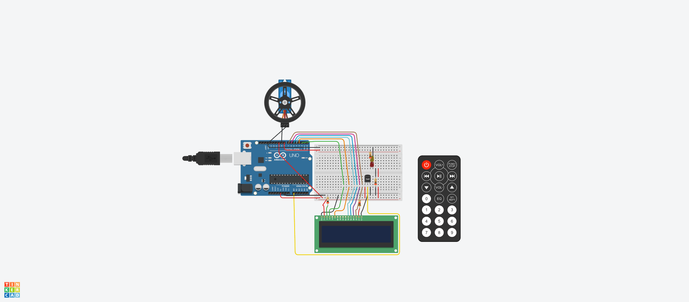

## Sistema de incendios

---
## Descripcion:
El código proporcionado es un programa en C++ que simula el funcionamiento de un montacargas controlado por botones y LEDs. Utiliza un visualizador de 7 segmentos para mostrar el piso actual y LEDs para indicar el estado (en movimiento o en pausa). Los botones permiten subir, bajar y pausar el montacargas. El programa se ejecuta en una placa Arduino y utiliza el monitor serial para mostrar mensajes informativos. En resumen, es una simulación interactiva de un montacargas con control de pisos.
---
## Configuración de pines
---
~~~c++
// Configuración del control remoto IR
int RECV_PIN = 11;
IRrecv irrecv(RECV_PIN);
decode_results results;

// Configuración del display LCD
LiquidCrystal lcd(2, 3, 4, 5, 6, 7);

// Configuración del sensor de temperatura
int sensorPin = A0;

// Configuración del servo motor
int servoPin = 9;
Servo servo;

// Configuración de los leds
int ledPin1 = 8;
int ledPin2 = 10;

~~~
## Variables
~~~c++
// Umbral de temperatura para detectar incendio
int temperaturaUmbral = 60;

// Rangos de temperatura para cada estación
int temperaturaInviernoMin = -10;
int temperaturaInviernoMax = 10;
int temperaturaPrimaveraMin = 10;
int temperaturaPrimaveraMax = 25;
int temperaturaVeranoMin = 25;
int temperaturaVeranoMax = 40;
int temperaturaOtonioMin = 10;
int temperaturaOtonioMax = 25;
~~~
Se define el pin en el que está conectado el receptor IR (RECV_PIN) y se crea una instancia de IRrecv llamada irrecv para recibir las señales del control remoto.
Se crea una instancia de LiquidCrystal llamada lcd para controlar el display LCD. Se especifican los pines de conexión del display.
Se define el pin en el que está conectado el sensor de temperatura (sensorPin).
Se define el pin en el que está conectado el servo motor (servoPin) y se crea una instancia de Servo llamada servo para controlarlo.
Se definen los pines en los que están conectados los leds de alarma (ledPin1 y ledPin2).
Se establece el umbral de temperatura (temperaturaUmbral) a partir del cual se considera que hay un incendio.
Se definen los rangos de temperatura para cada estación del año.

## Función de configuración (setup)
~~~c++
void setup() {
  // Inicialización del control remoto IR
  irrecv.enableIRIn();

  // Inicialización del display LCD
  lcd.begin(16, 2);
  lcd.setCursor(0, 0);
  lcd.print("Temp:");
  lcd.setCursor(0, 1);
  lcd.print("Estacion:");

  // Inicialización del servo motor
  servo.attach(servoPin);

  // Configuración de los leds
  pinMode(ledPin1, OUTPUT);
  pinMode(ledPin2, OUTPUT);
}
~~~
En esta parte del código se realiza la inicialización de los componentes necesarios para el funcionamiento del sistema de incendio. Se habilita el control remoto IR, se configura y muestra el display LCD, se habilita el control del servo motor y se configuran los pines de los leds como salidas.

También se inicializa el monitor serial para permitir la comunicación con una computadora. Se establece una velocidad de transmisión de 9600 baudios. Luego, se imprime un mensaje por el monitor serial para indicar que el montacargas está listo para su uso, y se establece la variable mostrarMensaje en true para que se muestre el mensaje.

## Función principal (loop)
~~~c++
void loop() {
  // Lectura de temperatura
  int temperatura = obtenerTemperatura();

  // Mostrar temperatura en el display LCD
  lcd.setCursor(6, 0);
  lcd.print(temperatura);

  // Determinar estación del año
  String estacion = obtenerEstacion(temperatura);

  // Mostrar estación del año en el display LCD
  lcd.setCursor(10, 1);
  lcd.print(estacion);

  // Verificar si se ha detectado un incendio
  if (temperatura > temperaturaUmbral) {
    activarAlarma();
  } else {
    desactivarAlarma();
  }

  // Verificar si se ha recibido una señal del control remoto IR
  if (irrecv.decode(&results)) {
    // Verificar el código del botón presionado
    switch (results.value) {
      case 0xFFA25D:  // Código del botón para activar el sistema de incendio
        activarSistemaIncendio();
        break;
      case 0xFF629D:  // Código del botón para desactivar el sistema de incendio
        desactivarSistemaIncendio();
        break;
      // Agrega más casos para otros botones del control remoto si es necesario
    }
    irrecv.resume();  // Recibir el siguiente valor
  }
}
~~~
La función loop() se encarga de leer la temperatura, mostrarla en el display LCD, determinar la estación del año, verificar si hay un incendio, y responder a las señales del control remoto IR para activar o desactivar el sistema de incendio. El bucle se repite continuamente para monitorear y actualizar la información según sea necesario.
## ObtenerTemperatura():
~~~c++
int obtenerTemperatura() {
  // Realizar la lectura del sensor de temperatura y calcular la temperatura en grados Celsius
  int lectura = analogRead(sensorPin);
  float voltaje = lectura * 5.0 / 1024.0;
  float temperaturaCelsius = (voltaje - 0.5) * 100;

  return (int)temperaturaCelsius;
}
~~~
Esta función lee el valor del sensor de temperatura y realiza cálculos para convertir el valor leído en grados Celsius. Devuelve la temperatura como un entero.

## ObtenerEstacion: 
~~~c++  
String obtenerEstacion(int temperatura) {
  if (temperatura >= temperaturaInviernoMin && temperatura <= temperaturaInviernoMax) {
    return "Invierno";
  } else if (temperatura >= temperaturaPrimaveraMin && temperatura <= temperaturaPrimaveraMax) {
    return "Primavera";
  } else if (temperatura >= temperaturaVeranoMin && temperatura <= temperaturaVeranoMax) {
    return "Verano";
  } else if (temperatura >= temperaturaOtonioMin && temperatura <= temperaturaOtonioMax) {
    return "Otonio";
  } else {
    return "Desconocida";
  }
}
~~~
Esta función recibe un valor de temperatura y determina la estación del año en función de los rangos de temperatura establecidos. Devuelve un objeto String que representa la estación correspondiente (por ejemplo, "Invierno", "Primavera", "Verano", "Otonio" o "Desconocida").

## ActivarAlarma: 
~~~c++  
void activarAlarma() {
  // Activar el servo motor y los leds de alarma
  servo.write(90);
  digitalWrite(ledPin1, HIGH);
  digitalWrite(ledPin2, HIGH);

  // Mostrar mensaje de alarma en el display LCD
  lcd.setCursor(0, 1);
  lcd.print("ALARMA!");

  delay(1000);  // Esperar 1 segundo
}
~~~
Esta función activa el servo motor y los LEDs de alarma. Además, muestra un mensaje de "ALARMA!" en el display LCD. Luego, espera 1 segundo utilizando delay().

## DesactivarAlarma: 
~~~c++
void desactivarAlarma() {
  // Desactivar el servo motor y los leds de alarma
  servo.write(0);
  digitalWrite(ledPin1, LOW);
  digitalWrite(ledPin2, LOW);

  // Borrar mensaje de alarma en el display LCD
  lcd.setCursor(0, 1);
  lcd.print("        ");
}
~~~
Esta función desactiva el servo motor y los LEDs de alarma. También borra el mensaje de alarma en el display LCD, dejando un espacio en blanco en su lugar.

## ActivarSistemaIncendio: 
~~~c++
void activarSistemaIncendio() {
  // Aquí puedes agregar el có
  digitalWrite(ledPin1, HIGH);
  digitalWrite(ledPin2, HIGH);
}
~~~
Esta función contiene el código necesario para activar el sistema de incendio. Puedes agregar aquí el código específico para tu sistema, como encender una sirena o activar un sistema de rociadores de agua. En el ejemplo proporcionado, se encienden dos LEDs para simular la activación del sistema de incendio.

## DesactivarSistemaIncendio: 
~~~c++  
void desactivarSistemaIncendio() {
  
  digitalWrite(ledPin1, LOW);
  digitalWrite(ledPin2, LOW);
}
~~~
Esta función contiene el código necesario para desactivar el sistema de incendio. Puedes agregar aquí el código específico para detener adecuadamente los componentes activados anteriormente en tu sistema. En el ejemplo proporcionado, se apagan los LEDs que simulaban la activación del sistema de incendio.

En resumen, estas funciones realizan tareas específicas dentro del programa, como obtener la temperatura, determinar la estación del año, activar y desactivar la alarma y el sistema de incendio, y controlar los componentes electrónicos conectados, como el servo motor, los LEDs y el display LCD.
