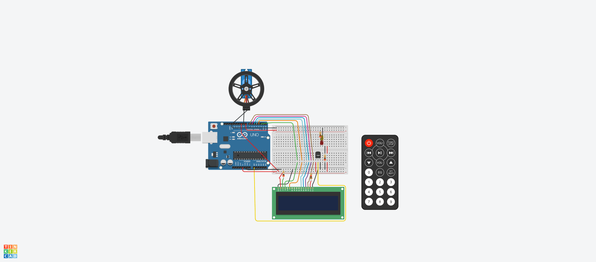

## Sistema de incendios

---
## Descripcion:
El código proporcionado es un programa en C++ que simula el funcionamiento de un montacargas controlado por botones y LEDs. Utiliza un visualizador de 7 segmentos para mostrar el piso actual y LEDs para indicar el estado (en movimiento o en pausa). Los botones permiten subir, bajar y pausar el montacargas. El programa se ejecuta en una placa Arduino y utiliza el monitor serial para mostrar mensajes informativos. En resumen, es una simulación interactiva de un montacargas con control de pisos.
---
## Configuración de pines
---
~~~c++
// Configuración de los pines para el visualizador de 7 segmentos
#define PIN_A 10
#define PIN_B 11
#define PIN_C 5
#define PIN_D 6
#define PIN_E 7
#define PIN_F 9
#define PIN_G 8

//Configuración de los pines para los botones y LEDs
#define PIN_BOTON_SUBIR 2
#define PIN_BOTON_BAJAR 3
#define PIN_BOTON_PAUSAR 4
#define PIN_LED_VERDE 13
#define PIN_LED_ROJO 12
~~~
## Variables
~~~c++
//Variables para el control del montacargas
int pisoActual = 0; // El montacargas comienza en el piso 1
int pisoAnterior = 1; // Variable para almacenar el piso anterior
bool enMovimiento = false;
bool enPausa = false;
bool mostrarMensaje = false; // Variable para controlar la visualización del mensaje.
~~~
Aquí se declaran las variables utilizadas para controlar el montacargas. pisoActual y pisoAnterior almacenan el número de piso actual y el piso anterior, respectivamente. enMovimiento y enPausa son variables booleanas que indican si el montacargas está en movimiento o en pausa. mostrarMensaje se utiliza para controlar la visualización de un mensaje.

## Función de configuración (setup)
~~~c++
void setup() {
  // Configuración de los pines
  pinMode(PIN_A, OUTPUT);
  pinMode(PIN_B, OUTPUT);
  pinMode(PIN_C, OUTPUT);
  pinMode(PIN_D, OUTPUT);
  pinMode(PIN_E, OUTPUT);
  pinMode(PIN_F, OUTPUT);
  pinMode(PIN_G, OUTPUT);

  pinMode(PIN_BOTON_SUBIR, INPUT_PULLUP);
  pinMode(PIN_BOTON_BAJAR, INPUT_PULLUP);
  pinMode(PIN_BOTON_PAUSAR, INPUT_PULLUP);

  pinMode(PIN_LED_VERDE, OUTPUT);
  pinMode(PIN_LED_ROJO, OUTPUT);

  // Inicialización del monitor serial
  Serial.begin(9600);
  Serial.println("El montacargas está listo para su uso.");
  mostrarMensaje = true;
}
~~~
En la función setup(), se configuran los pines utilizados en el sistema. Los pines del visualizador de 7 segmentos se configuran como salidas, mientras que los pines de los botones y los LEDs se configuran como entradas (con resistencias de pull-up internas habilitadas mediante INPUT_PULLUP).

También se inicializa el monitor serial para permitir la comunicación con una computadora. Se establece una velocidad de transmisión de 9600 baudios. Luego, se imprime un mensaje por el monitor serial para indicar que el montacargas está listo para su uso, y se establece la variable mostrarMensaje en true para que se muestre el mensaje.

## Función principal (loop)
~~~c++
void loop() {
  // Actualizar el display de 7 segmentos
  actualizarDisplay();

  // Comprobar el estado de los botones
  bool botonSubirPresionado = digitalRead(PIN_BOTON_SUBIR) == LOW;
  bool botonBajarPresionado = digitalRead(PIN_BOTON_BAJAR) == LOW;
  bool botonPausarPresionado = digitalRead(PIN_BOTON_PAUSAR) == LOW;

  if (botonSubirPresionado) 
  {
    if (pisoActual < 10) {
      pisoActual++;
      iniciarMovimiento();
    }
  }

  if (botonBajarPresionado) 
  {
    if (pisoActual > 0) {
      pisoActual--;
      iniciarMovimiento();
    }
  }

  if (botonPausarPresionado ) {
    pausarMovimiento();
  }

  // Detener el montacargas si ha llegado al piso deseado (piso 10 en este caso)
  if (pisoActual == 10) {
    detenerMontacargas();
  }
  // Mostrar el piso actual por el monitor serial solo si ha cambiado
  if (pisoActual != pisoAnterior && mostrarMensaje) {
    Serial.print("Piso actual: ");
    Serial.println(pisoActual);
    pisoAnterior = pisoActual;
    mostrarMensaje = false; // Reiniciar la variable para evitar repeticiones
  }
}
~~~
En la función loop(), se realiza el funcionamiento principal del montacargas. En primer lugar, se llama a la función actualizarDisplay() para mostrar el número del piso actual en el visualizador de 7 segmentos.

Luego, se comprueba el estado de los botones. Si el botón "Subir" es presionado y el piso actual es menor a 10, se incrementa el número del piso actual y se llama a la función iniciarMovimiento() para iniciar el movimiento del montacargas. Si el botón "Bajar" es presionado y el piso actual es mayor a 0, se decrementa el número del piso actual y se llama a la función iniciarMovimiento().

Si el botón "Pausar" es presionado, se llama a la función pausarMovimiento() para pausar o reanudar el movimiento del montacargas.

A continuación, se verifica si el montacargas ha llegado al piso deseado (piso 10 en este caso) y se llama a la función detenerMontacargas() para detenerlo si es necesario.

Finalmente, se verifica si el número del piso actual ha cambiado y se muestra por el monitor serial si es el caso. La variable mostrarMensaje se reinicia a false para evitar repeticiones en la visualización del mensaje.

## Funciones auxiliares
El código también incluye varias funciones auxiliares que realizan tareas específicas:

### ActualizarDisplay(): 
Esta función actualiza el visualizador de 7 segmentos para mostrar el número del piso actual.

### IniciarMovimiento(): 
Esta función se encarga de iniciar el movimiento del montacargas. Establece la variable enMovimiento en true, enciende el LED verde y apaga el LED rojo. Luego, se introduce un retardo de 3 segundos para simular el tiempo de trayecto entre pisos.

### PausarMovimiento(): 
Esta función se utiliza para pausar o reanudar el movimiento del montacargas. Cambia el estado de la variable enPausa y controla el encendido y apagado de los LEDs rojo y verde, respectivamente.

### DetenerMontacargas(): 
Esta función detiene el montacargas. Establece la variable enMovimiento en false, apaga ambos LEDs y muestra un mensaje en el visualizador de 7 segmentos indicando que el montacargas ha llegado al piso deseado.

Estas funciones contribuyen al funcionamiento integral del código, controlando el estado del montacargas, su movimiento, la visualización de información y la interacción con los botones y LEDs.

## Conclusion:
En resumen, el código proporcionado implementa la lógica necesaria para simular el funcionamiento de un montacargas controlado por botones y LEDs. Utiliza un visualizador de 7 segmentos para mostrar el piso actual y permite subir, bajar y pausar el montacargas mediante los botones. Es un ejemplo sencillo pero ilustrativo de cómo utilizar Arduino para crear sistemas interactivos.
---

### Link del proyecto
(https://www.tinkercad.com/things/3XWsC0kZX4A-brave-allis/editel?sharecode=Yl2GdbfGAnVYPyJau5jOaADwWcix08luKyl6xvmoB68)
